# music

Music library and embedding video for database course.  
Designed in Django.  

## Install

```
pip install -r requirements.txt
```

## Contributor

Haonan Wu  
Changxing Cao  


## E-R:
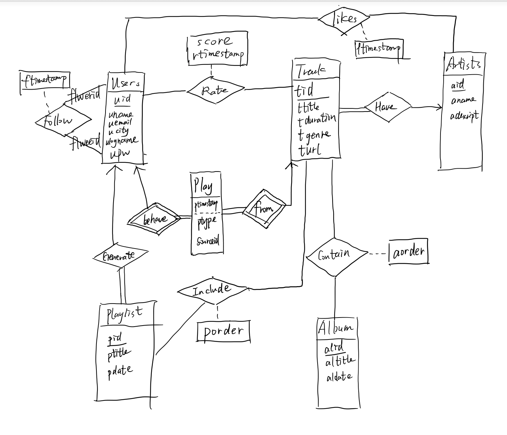


## Each part How we designed:
We design the website by Django 1.8 and python 3 with several third party library including: 			
django-inspect		
django-embed-video		
django-bootstrap-form 		
django-redis 		
django-filter 				
We design 7 web applications, music, core, songs, artists, albums, playlists, admin system. 			

**Music:**				


The kernel application for the whole system, master application.			
This application is charge of the settings for the website, and communicate with the browsers under Web Server Gateway Interface (WSGI) standards. 		
			
**Core:**			


The kernel application for user management:


User Login, User Sign up, User profile and profile edition


User Followed Users List, User Favorite Artists List, User Playlist List, UserUser Play Records List 			

All user information lists: Homepage, User List, User Detail 		
			
All the operations which are relevant to Table User, Like, Follow: Follow a user
Like an artist	;	Unfollow a user;   Unlike an artist 			

**Songs:**			


The application relevant to Table Song, Rate: Song List, Song Detail, Song Play
Song Rate 			
Albums:			
The application relevant to Table Album: Album List, Album Detail 			
Playlists:			
The application relevant to Table Playlist: Playlist Creation, Playlist List, Playlist Detail 			


**Artists:**			


The application relevant to Table Artist: Artist List, Artist Detail 		
				
**Admin:**			


The application about database management.				
This application enable the administrators to access the database without using SQL. They modify the database through this application. 		
				
**Cache Part:**				

In this website system, we have add some simple cache system to reduce the database I/O. We use redis as Timed-cache with expiration. It is a in-memory database system which supports data structures such as strings, hashes, lists, sets, sorted sets with range queries, bitmaps, hyperloglogs and geospatial indexes with radius queries. 


## Some function samples description:

In the table Play, we design a attribute (ptype) to show the source type of the track, if ptype equals to 0, it means that the song is played from a album, and the source id references to an album’s alid; if ptype equals to 1, it means that the song is played from playlist, and the source id references to a playlist’s pid; if ptype equals to 2, the song is played outside any playlist or album, so the source id is null. Because in different cases, the source id references to different attribute of different table, it can’t  be designed as a foreign key. And compared with using several tables to store the three kinds of sources, it will cost a little more space but easily be implemented.

In table Users, profile has ‘name’, ‘email’,’city’, they can be null and users can update their profile after they sign up and log in.

In table Track, we store url in this table, so when we need to play this song, we can just link the url with this song. 

In table Follow, there are two options that we can use, 1.use type to decide the two users’ relation; 2. Use the attribute to decide who follows who. We choose 2, and when we want to see which two users follow each other, we just need to add "a.uid<b.uid" to delete repeated data.				


## Database Relationship Design

**Users (uid, uname, uemail, ucity, ulogname, upw)**
```
Primary Key: uid

Uid: Users’ id number, auto increase, not null;

Uname: Users’ name, can be null;

Uemail: Users’ email, can be null;

Ucity: The city users live in, can be null;

Ulogname: The nick name to log in, not null;

Upw: Password to log in, not null;
```
 

**Track (tid, ttitle, tduration, tgenre, turl, aid)**
```
Primary Key: tid

Foreign key: Track.aid references Artists.aid

Tid: songs’ id number, not null;

Ttitle: song’s name, not null;

Tduration: the total time that playing this song will cost, not null;

Tgenre: the genre of the song, not null;

Turl: the source web url of the song, not null;

Aid: the id number of Artist, not null;
```

 

**Artists (aid, aname, adescript)**
```
Primary Key: aid

Aid: the id number of Artist, not null;

Aname: artist’s name, not null;

Adescript: the description of the artist, not null;
```

 

**Playlist (pid, ptitle, pdate, uid)**
```
Primary Key: pid

Foreign key: Playlist.uid references Users.uid

Pid: the id number of playlist, not null;

Ptitle: the title name of playlist, not null;

Pdate: the datetime that the playlist created, not null;

Uid: users’ id number;
```
 

**Album (alid, altitle, aldate)**
```
Primary Key: alid

Alid: id number of album, not null;

Altitle: title name of the album, not null;

Aldate: the title date time that album released, not null;
```
 

**AlbumTrack (alid, tid, aorder)**
```
Primary Key: alid, tid

Foreign key: AlbumTrack.alid references Album.alid

					AlbumTrack.tid references Track.tid

Aorder: the order of one track in one album, not null;
```
 

**PlaylistTrack (pid, tid, porder)**
```
Primary Key: pid, tid

Foreign key: PlaylistTrack.pid references Playlist.pid

                     PlaylistTrack.tid references Track.tid

Porder: the order of one track in one playlist, not null;
```
 

**Likes (uid, aid, ltimestamp)**
```
Primary Key: uid, aid

Foreign key: Likes.uid references Users.uid

					Likes.aid references Artists.tid

Ltimestamp: the timestamp when user likes one artist
```
 

**Rate (uid, tid, rtimestamp, score)**
```
Primary Key: uid, tid

Foreign key: Rate.uid references Users.uid

Rate.tid references Track.tid

Rtimestamp: the timestamp when user rates one track song

Score: the score that one user rates

Follow (flwerid, flweeid, ftimestamp)

Primary Key: flwerid, flweeid

Foreign key: Follow.flwerid references Users.uid

                     Follow.flweeid references Users.uid

Flwerid: the follower’s user id (A follows B, this will store A id)

Flweeid: the one who is followed id (store B id)
```
 

**Play (uid, tid, ptype, sourceid, ptimestamp)**
```
Primary Key: uid, tid, ptimestamp

Foreign key: Play.uid references Users.uid

					Play.tid references Track.tid

Ptype: which kind of source the track playing come from, 0--album; 1--playlist; 2--others

Ptype=0,1,2.  Use "check ptype<=2 and ptype>=0"

Sourceid: the source id of the track, can be null;

Ptimestamp: the timestamp when user plays a song, not null
```
## Example of some SQL query
Hope to help someone review or learn SQL, kinda forget some query's purposes, the report.pdf have the whole version, or just ignore the following : )

```
SELECT art.aid, art.aname, COUNT(Track.tid)

FROM Artists as art, Track

WHERE art.aid = Track.aid

GROUP BY art.aid;
```

```
SELECT art.aid

FROM Artists as art, Track

WHERE Track.aid = art.aid

AND Track.tgenre='Jazz'

GROUP BY Track.aid

HAVING 2*SUM(Track.tid) >= (

    SELECT SUM(t.tid)

    FROM Artists as a, Track as t

    WHERE a.aid = t.aid AND a.aid = Track.aid

    GROUP BY t.aid

    );
```

```
SELECT pl.pid, pl.ptitle, pl.uid

FROM Playlist as pl, Users

WHERE pl.uid = Users.uid

AND Users.uid IN (

    SELECT Follow.flwerid

    FROM Follow, Users AS u

    WHERE u.uname = 'NancyInQueens'

    AND u.uid = Follow.flweeid

    );
```

```
SELECT Track.tid, Track.ttitle

FROM Track, Artists AS art

WHERE Track.aid = art.aid

AND (CONTAIN(Track.ttitle, "love") OR CONTAIN(art.adescript, "love"));
```

```
SELECT a1.aid, a2.aid

FROM Artists AS a1, Artists AS a2, Like AS l1, Like AS l2

WHERE a1.aid > a2.aid AND a1.aid = l1.aid AND a2.aid = l2.aid AND l1.uid = l2.uid

GROUP BY a1.aid, a2.aid

HAVING 2*SUM(l1.uid) >= (

    SELECT SUM(l3.uid)

    FROM Like AS l3

    WHERE a1.aid = l3.aid

    GROUP BY a1.aid

    )

AND 2*SUM(l1.uid) >= (

    SELECT SUM(l4.uid)

    FROM Like AS l4

    WHERE a2.aid = l4.aid

    GROUP BY a2.aid

    );
```

## Tables Design

**User Table**


**Track Table**

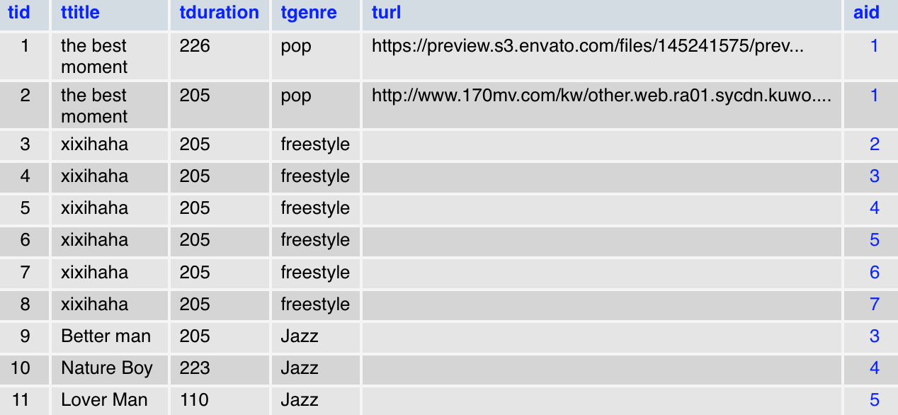

**Album Table**

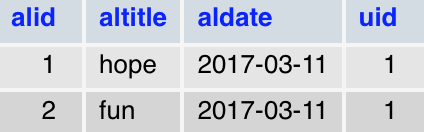

**Playlist Table**

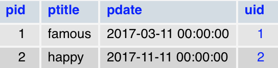

**Albumtrack Table**

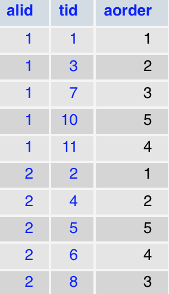

**Playlisttrack**

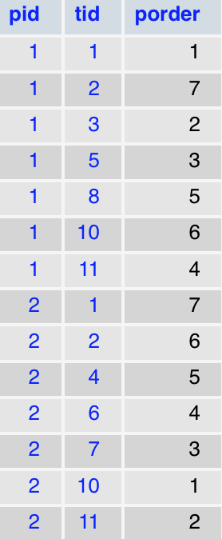

**Artists Table**

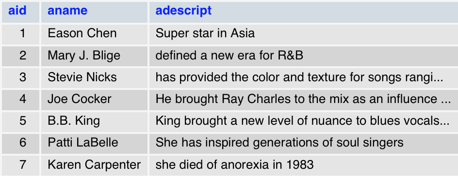

**Rate Table**


**Likes Table**

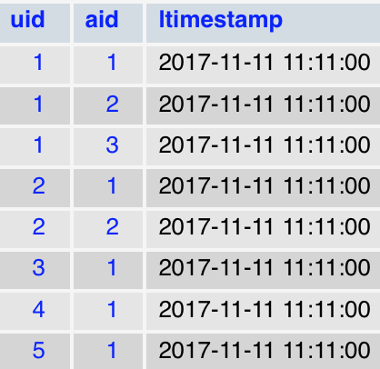

**Follow Table**

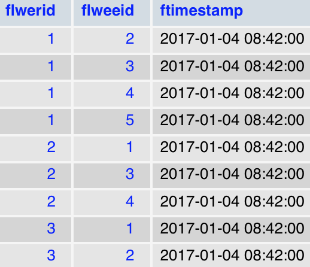


## Show of the whole web: 

**User Table**


**Track Table**

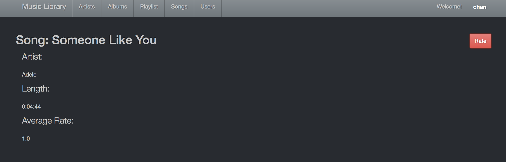

**Album Table**

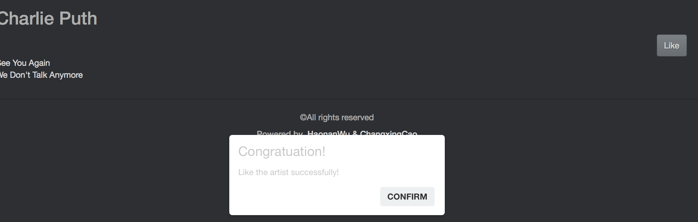

**Playlist Table**

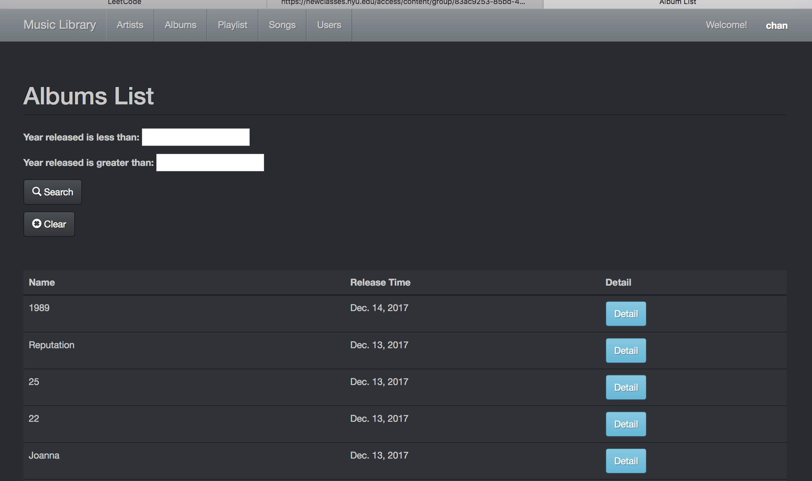

**Albumtrack Table**

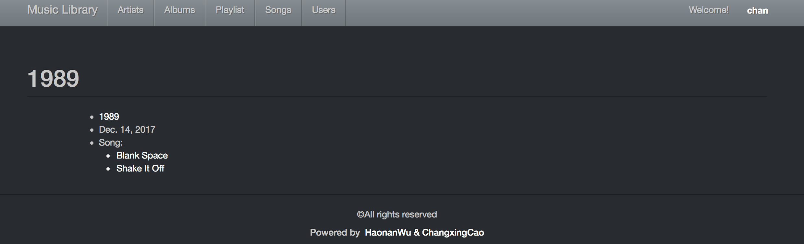

**Playlisttrack**

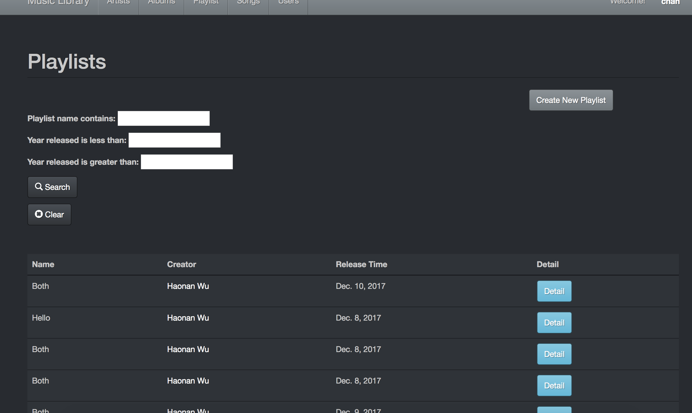

**Artists Table**

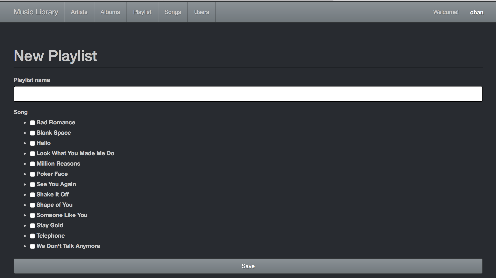

**Rate Table**

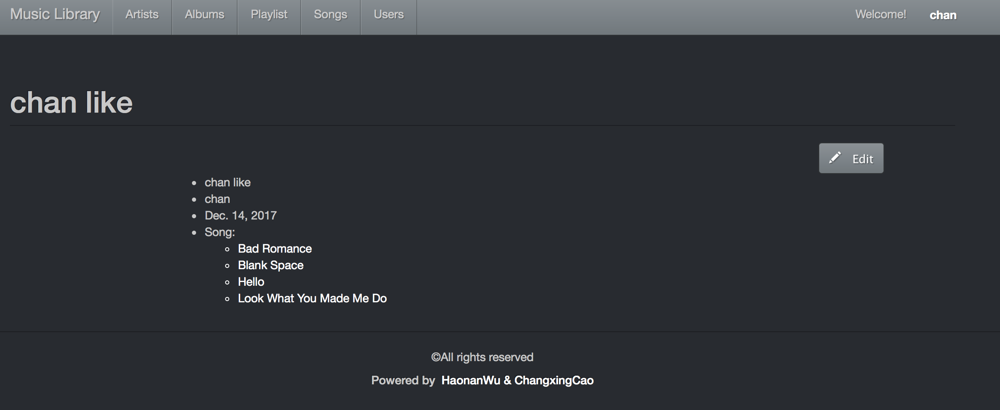

**Likes Table**

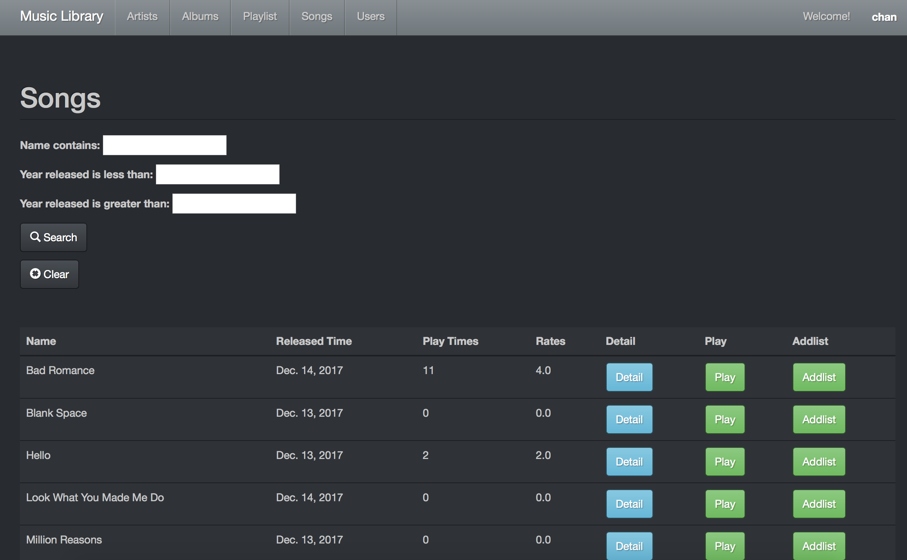

**Follow Table**

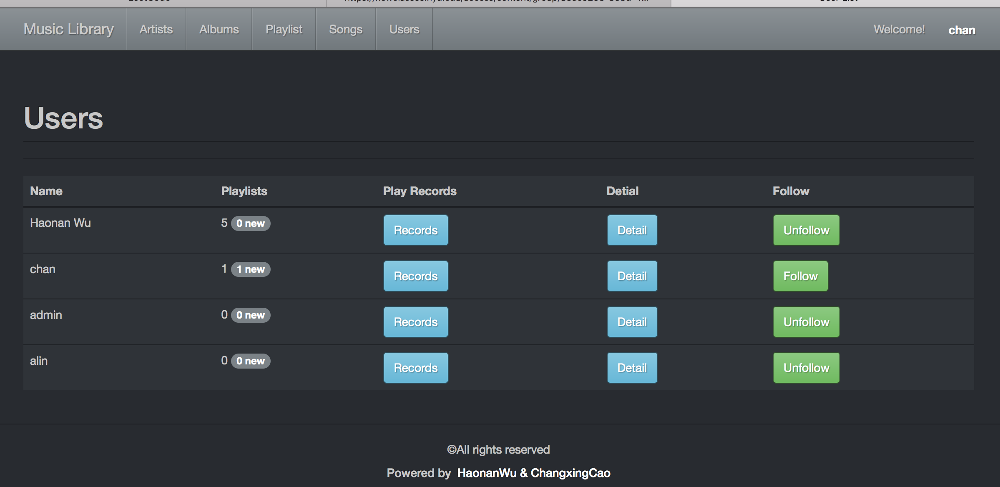


